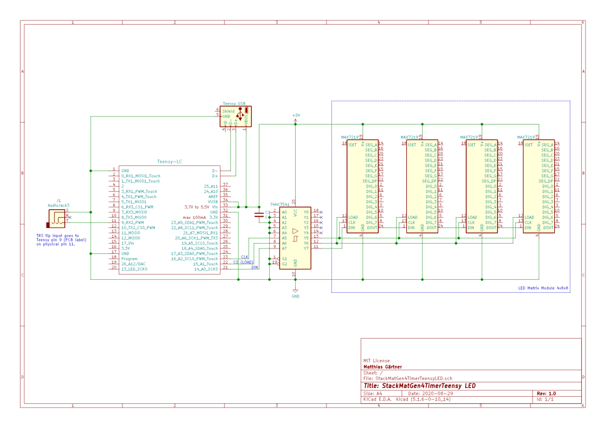

# KiCAD Schematic for StackMatGen4TimerTeensyLED

The Teensy-LC component is available at [https://github.com/XenGi/teensy_library](https://github.com/XenGi/teensy_library)

KiCAD files:
- [StackMatGen4TimerTeensyLED.pro](StackMatGen4TimerTeensyLED.pro)
- [StackMatGen4TimerTeensyLED.sch](StackMatGen4TimerTeensyLED.sch)
- [StackMatGen4TimerTeensyLED.svg](StackMatGen4TimerTeensyLED.svg)

