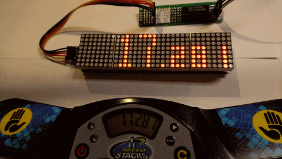
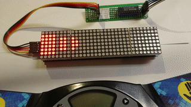

# StackMatGen4TimerTeensy

How to decode the StackMat Gen4 Speed Cubing / Stacking Timer protocol?

Turns out that it's possible to hook up the StackMat timer to a Teensy microcontroller **without** any soldering. Just run a wire from the StackMat TRS connector (signal, ground) to the Teensy (Rx2, ground) and let the Teensy's built-in UART decode the packet bytes.
Add some lines of code to assemble and decode the packets, do checksum check for some resilience, and output the contained time payload on some display.

# OLED Display

First example outputs the time in six-digits "0:00:000" format (e.g. "0:12:258", minute, seconds, thousands) on a small 128x64 OLED display.

The wiring is pretty trivial.

The StackMat signal goes directly to input pin 9 (Rx2) of the Teensy. No IC, no resistor, no transistor inverter, just a wire.

The OLED is connected via I2C. This requires four wire connections (3V3, Ground, SCL pin 19, SDA pin 18) plus two _optional but recommended_ pull-up resistors on SDA and SCL.
See [StackMatGen4-Timer.md](StackMatGen4-Timer.md) for further details.

## Software

See [Teensy-StackMat-OLED.ino](src/Teensy-StackMat-OLED/Teensy-StackMat-OLED.ino)

If you find that some existing decoder software cannot read Gen4 packets, please consider these points:
1. The packet length is now 10 bytes, earlier packets were only 9 bytes in length, one digit less;
2. accordingly, the check byte is computed from 6 time digits, not only 5;
3. the inter-packet gap is shorter, this may cause packet start detection to fail.

# LED Display

For the second example, let's connect a brighter LED Matrix display with 4x8x8 LEDs. Such displays are often based on MAX7219 components and can be hooked up to the microcontroller with just three wires.

Alas, these displays are 5V-only. We can pull 5V conveniently from the Teensy's USB port. But unfortunately, this also means that we need to de-couple the 3V3-only Teensy-LC output pins from the display side. I used an old TI 74HC541 octo-buffer for this which I had lying in a box - its date code is 618XN, this unit is from 1986! Such HCT buffers run on 5V, accept 3V on their input side as "High" and can drive the LED matrix interface easily.

Caveat: there may be easier ways to interface Teensy-LC to this specific LED display, maybe a resistor only, or maybe even just a wire, but I have not tried that out for fear of frying my units. Clearly, a 5V-tolerant microcontroller would be nicer for this use, w/o the need for a buffer, but I did not check if that is readily available **with** that inverse UART feature that makes it so easy to interface to the StackMat timer.

For wiring details, see [KiCAD/README.md](KiCAD/README.md). The input side with the single wire to the StackMat is the same as with the OLED version above.

## Software

See [Teensy-StackMat-LED.ino](src/Teensy-StackMat-LED/Teensy-StackMat-LED.ino) and auxiliary files in [src/Teensy-StackMat-LED](src/Teensy-StackMat-LED).

This code works fine for me, but may be limited to just **one** wiring scheme of the LED matrix display. Other libraries may be more flexible here, as they can be configured to various in-the-wild matrix wirings. Notably, [https://github.com/MajicDesigns/MD_Parola](https://github.com/MajicDesigns/MD_Parola) might be a better fit if your display is not compatible.

The display I used is the [MAX7219 8x32 4 in 1 Dot Matrix LED Display Module for Arduino](https://www.az-delivery.de/en/products/4-x-64er-led-matrix-display) from a local (German) supplier [AZ-Delivery](https://www.az-delivery.de). The wiring of this display type is
 - lowest address (+0) controls the bottommost display row
 - highest address (+7) controls the topmost display row
 - least significant bit (0x01) controls the leftmost LED in the row
 - most significant bit (0x80) controls the rightmost LED in the row

When starting the Teensy, it waits for StackMat packets. While waiting, the LED shows a scrolling "plug in" animation. This also appears when the StackMat gets disconnected or switched off, after a couple of seconds. Any valid packet that gets received will switch to the normal time display mode.

The StackMat time information is shown with seconds in a larger font and milliseconds in a smaller font. Leading zero minutes and 10s of seconds are not shown, for a cleaner display impression.

# Happy cubing!
