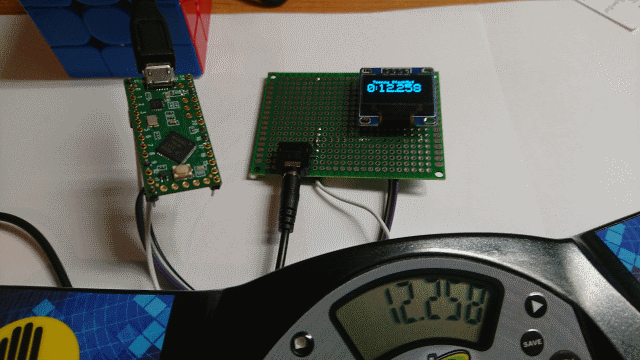
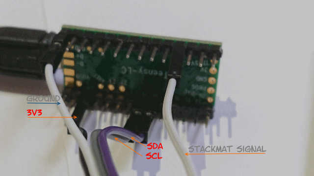

# StackMatGen4TimerTeensy

How to decode the StackMat Gen4 Speed Cubing / Stacking Timer protocol?

Turns out that it's possible to hook up the StackMat timer to a Teensy microcontroller **without** any soldering. Just run a wire from the StackMat TRS connector (signal, ground) to the Teensy (Rx2, ground) and let the Teensy's built-in UART decode the packet bytes.
Add some lines of code to assemble and decode the packets, do checksum check for some resilience, and output the contained time payload on some display.

## OLED Display

First example outputs the time in six-digits "0:00:000" format (e.g. "0:12:258", minute, seconds, thousands) on a small 128x64 OLED display.

The wiring is pretty trivial.

The StackMat signal goes directly to input pin 9 (Rx2) of the Teensy. No IC, no resistor, no transistor inverter, just a wire.

The OLED is connected via I2C. This requires four wire connections (3V3, Ground, SCL pin 19, SDA pin 18) plus two _optional but recommended_ pull-up resistors on SDA and SCL.
See [StackMatGen4-Timer.md](StackMatGen4-Timer.md) for further details.

# Software

See [Teensy-StackMat-OLED.ino](src/Teensy-StackMat-OLED/Teensy-StackMat-OLED.ino)

If you find that some existing decoder software cannot read Gen4 packets, please consider these points:
1. The packet length is now 10 bytes, earlier packets were only 9 bytes in length, one digit less;
2. accordingly, the check byte is computed from 6 time digits, not only 5;
3. the inter-packet gap is shorter, this may cause packet start detection to fail.

# Happy cubing!
