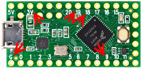

# Some notes about the StackMat Gen 4 Serial Protocol

## Overview

1200 baud, 8N1, 833µs per bit, 10 bytes, 10 bits per byte, 112ms packet period, 75ms per Packet, 37ms inter-packet gap, around 9 packets are sent per second.

Stackmat output is active-high with about 2,7V (depending on battery level, probably), through 2,5mm TRS connector.
 - T - Tip carries the signal.
 - R - Ring is not connected. I have read that the StackMat device outputs the signal on both left and right channels, I cannot confirm that for my unit.
 - S - Sleeve is Ground.

I was able to connect the StackMat through a 2,5mm-to-3,5mm adaptor cable to a [Teensy LC](https://www.pjrc.com/store/teensylc.html "Teensy LC") Pin 9 Rx2 and Ground with no further circuitry. The Teensy is running an 3V3 a well so the signal matches nicely. I found it is possible to use the built-in Teensy serial engine out of the box. No hand-crafted bit-decoding required (certainly _possible_, but not _required_). The key is to specify **inverse encoding** so that acive high voltage is interpreted as "space" by the serial decoder engine and zero Volts as "mark". The Teensy's **hardware decoder** provides sophisticated sampling and error checking, which makes reception resilient.



## Sample reading

Assume the Stackmat is powered up, then started and stopped at e.g. `1: 8.169`, one minute, 8 seconds, 169 milliseconds.

Packets of length 10 bytes are sent, which decode as follows::
```
0x49  I       Status: I or Space (see below)
0x31   1        minutes
0x30    0      decaseconds
0x38     8    seconds
0x31      1    deciseconds
0x36       6    centiseconds
0x39        9    milliseconds
0x59          Checksum, 64 + sum of digits, e.g. 64 + 1 + 0 + 8 + 1 + 6 + 9 = 64 + 25 = 89 = 0x59
0x0A LF
0x0D CR
```

Note that the decaseconds zero digit is suppressed on the StackMat display for some reason (looks odd, I think), but it's present in the emitted packets.

## Decoding the data stream

At least two viable decoding options exist.

1. Since good timing information is available on Arduino / Teensy with at least milliseconds granularity, it is possible to detect the first byte of a packet through its time distance from the preceding byte (e.g. last byte of the last packet). This can be independent of the actual payload (bytes content).
2. Protocol-based decocing is even easies, based on the redundant and constant packet content. Waiting for LF, then CR will reliably detect the end of a packet, especially as all other bytes (including checksum byte) will always have value no less than 0x20. Or, the bytes are simply checked in order against their respective range. This approach is taken by my small Teensy OLED / LED display application.

## Auto-Off

The 10-byte format above begs the question what happens after `9:59.999`? Amazingly, my StackMat unit switches off automatically! The last measurement was `959841` in the one run where I let it run up to that point. I cannot say if that exact milliseconds value is a result of some internal granularity. With that behaviour, there is no need for a change to the package format, let alone on the fly at or after `10:00:000`.

## Status Indicator

I am not able to see status codes other than I (0x49) or Space (0x20). If the timer is running, status code 0x20 is sent. In all other cases status code 0x49 is sent, e.g. if the timer is stopped, after reset, restart and/or at the end of a solve after touching both hands.

- `'I'` is sent after reset or restart, when no hand touches its sensor.
- `'I'` is sent when only one hand touches its sensor.
- `'I'` is sent during the wait time (after both hands have touched and remain so, before the green LED gets lit).
- `'I'` is sent in ready state (after the green LED lights up).
- `' '` is sent as soon as one or both handes are removed from the sensor, e.g. timer start.
- `' '` is sent as long as the timer counts. This remains the case even if one hand touches its sensor, or has never left the sensor since timer start.
- `'I'` is sent with the current timer count while the timer is running.
- `'I'` is sent after timer has stopped, with the measured (displayed) time. Touching the sensors with one or both hands do not change the status code.
- `'I'` is sent with value `000000` after reset

My application simply _ignores_ the status indicator beyond checking for the Gen3 known values (`'I', 'A', ' ', 'S', 'R', 'L', 'C'`) and just exposes the time part of the packets.

## Save Mode

Pressing the save or arrow buttons appears to have no effect while the timer is running. Pressing the arrow button while the timer does not run stops packet transmission. After cycling through any saved times and/or saving the current timer value it is required to press the "restart" button to return to non-memory-related timer operation. This resumes packet egress.

## Arduino?

The code in this repo is targeted towards ARM-based Teensy boards. AVR-based Arduinos do not have the inverse UART mode. For Arduino, some kind of inverter should be used on the signal line. Any NPN transistor with two resistors or some 3V3-compatible inverter IC should work. Then, the Arduino hardware UART should be usable in the same manner as here with the Teensy.
Alternatively, a software-based UART decoder should work fine. At just 1200 Baud, _any_ Arduino will likely be unterwhelmed performance-wise.
I did not pursue either of these options (yet). Please share if you do.

_v1.0, August 2020_
